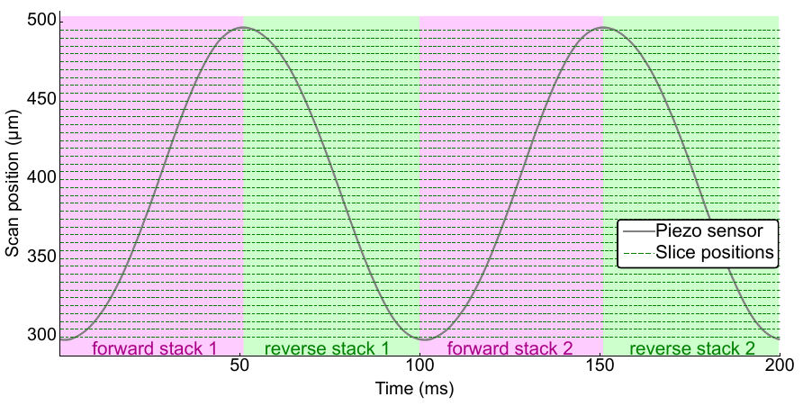

# FastScanning.jl

[](https://travis-ci.com/HolyLab/FastScanning.jl)
[](https://ci.appveyor.com/project/Cody-G/fastscanning-jl/branch/master)
[](https://codecov.io/gh/HolyLab/FastScanning.jl)

Package for calibrating fast scanning with the fast OCPI microscope published in:



Please see the publication for the full rationale of this package.  Below is a brief guide to use.

```julia
using FastScanning, ImagineInterface, Unitful
import Unitful: Hz, μm

rig = "ocpi-2"
pos_name = "axial piezo"
#set stacks/s (this will be twice the scan frequency of the piezo due to bidirectional imaging)
stack_rate = 10.0Hz
#lower limit of the piezo scan.  It's recommended not to start at the min position (0μm)
pstart = 50.0μm
#upper limit of the piezo scan.  It's recommended not to use the max position.
pstop = 260.0μm
#set z axis sample spacing
z_spacing = 5.0μm
#set amount of space to leave at edges of scan cycle
#i.e. if z_pad is 5.0μm and pstart:pstop is set as above,
#...then only the region from 55μm - 255μm will be imaged
z_pad = 5.0μm

coms = pos_commands(rig, pos_name, pstart, pstop, stack_rate;
                      sample_rate = 100000Hz, lp_cutoff=3.5*stack_rate)
```

The `pos_commands` function generates a set of commands that can be run by Imagine.jl
for the first calibration step.  No images are acquired in this step; we just record
the response of the piezo to the high-speed command. Note that `sample_rate` and
`lp_cutoff` are set to their default values above. `lp_cutoff` is the cutoff of the
lowpass filter applied to the triangle wave command.

NOTE: Increasing `stack_rate`, `lp_cutoff`, or the piezo range (`pstop`-`pstart`) may result in commands that
are not considered safe to run with Imagine because they may damage the piezo.
In this case you will get an error when saving the commands to
file or when trying to run them in the Imagine GUI.

The following code assumes the "coms" commands were run with the function `run_imagine`
from the [Imagine.jl](https://github.com/HolyLab/Imagine.jl) package, and then the results of the experiment
were loaded into the "recs" variable using [ImagineInterface.jl](https://github.com/HolyLab/ImagineInterface.jl).

```julia
pr = slicetiming_experiment(coms, recs, "488nm laser", "camera1", z_spacing, z_pad; subpixel=true)
st_coms = outputs(pr)
```

`pr` is an `ImagineProcedure` (see [ImagineProcedures.jl](https://github.com/HolyLab/ImagineProcedures.jl)) that generates
calibration commands for the microscope and then later analyzes the results of running the commands (see below).

The following code assumes that the "st_coms" commands were saved to a file with
ImagineInterface.jl and then run with the [Imagine](https://github.com/HolyLab/Imagine) GUI (imaging a
fluorescent bead sample), and the resulting image was loaded into the "img" variable.

```julia
fwd_lags, back_lags, slice_zs = process(pr, img)
```

`fwd_lags` and `back_lags` are vectors of temporal offsets (in seconds), with one offset for each
slice in the "forward" and "reverse" stacks.  These calibration values can be applied
by subtracting them from the corresponding naive sensor-based exposure timings to determine the
calibrated exposure timing.  It's recommended to run this calibration just before performing
an experiment.  If any scan parameter changes then the calibration should be run again.
`slice_zs` contains the precise depth at which each slice is acquired, respecting the `pstart`,
`pstop`, `z_spacing`, and `z_pad` arguments provided by the user.
